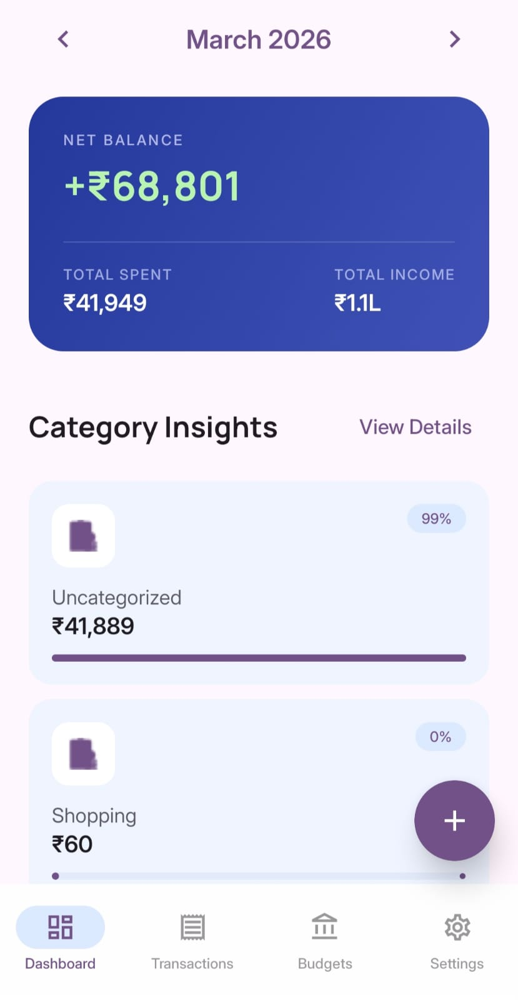
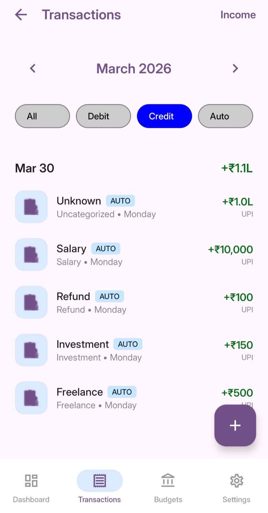
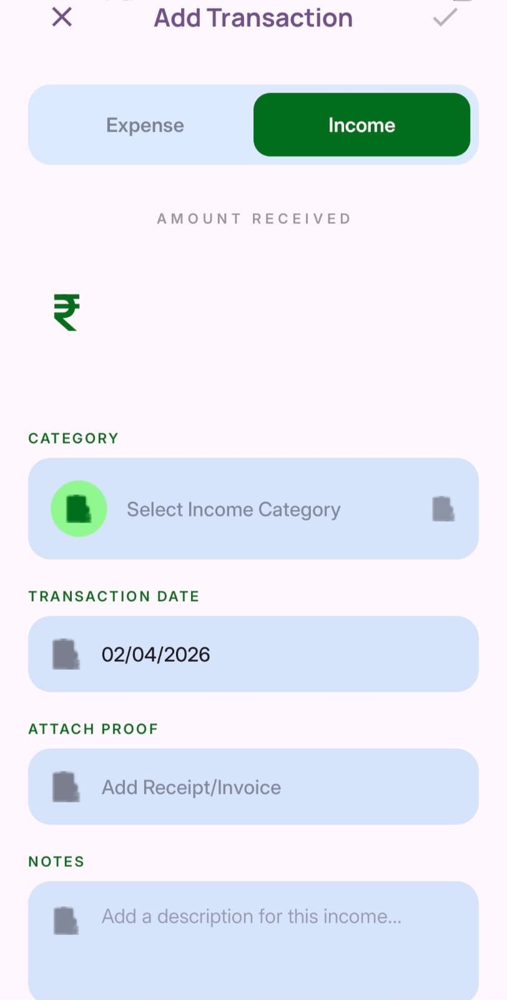
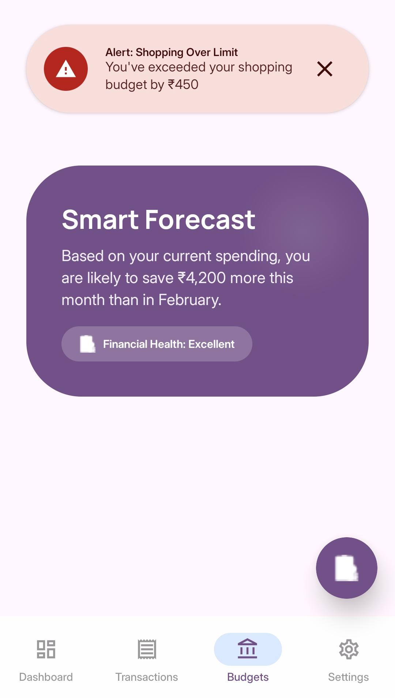
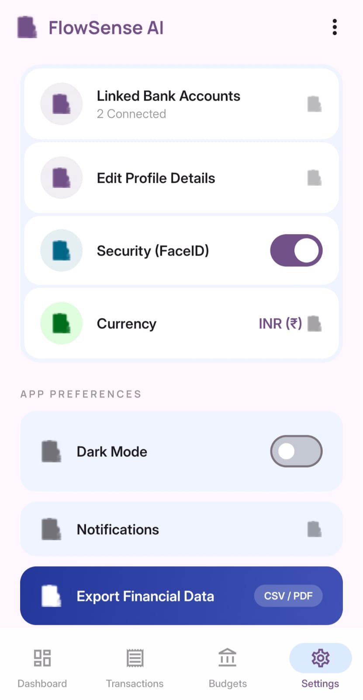

# 📊 FlowSenseAI

**AI-powered personal finance manager for Android** that automatically tracks transactions and turns raw payment data into meaningful financial insights.

---

## ✨ Overview

FlowSenseAI simplifies personal finance by combining **automation + AI intelligence** into a clean mobile experience.

It captures transactions, categorizes them intelligently, and provides actionable insights — all in real time.

---

## 🚀 Features

* 📥 Automatic transaction capture (notifications + manual input)
* 🧠 AI-powered categorization using TensorFlow Lite
* 📊 Smart insights powered by Gemini API
* 📈 Budget tracking with predictive forecasts
* 🔄 Real-time UI updates using Kotlin Flow
* 🔐 Secure and customizable user settings

---

## 📱 App Screens

### 🏠 Dashboard — Financial Snapshot

<p align="center">
  <br/>
  <em>Monthly summary with category-level spending insights</em>
</p>

---

### 💳 Transactions — Money Timeline

<p align="center">
  <br/>
  <em>Track income and expenses with filters and grouped timeline</em>
</p>

---

### ➕ Add Transaction — Manual Control

<p align="center">
  <br/>
  <em>Add or correct transactions with category, notes, and attachments</em>
</p>

---

### 📊 Budgets — AI Forecast & Alerts

<p align="center">
  <br/>
  <em>Overspending alerts and AI-generated financial forecasts</em>
</p>

---

### ⚙️ Settings — Personalization & Security

<p align="center">
  <br/>
  <em>Manage preferences, security, export, and integrations</em>
</p>

---

## 🔄 App Workflow

```text
1. Capture transaction signals (notifications / manual input)
2. Parse transaction details (amount, merchant, timestamp)
3. Categorize using ML (TensorFlow Lite)
4. Store locally using Room DB
5. Update UI reactively with Kotlin Flow
6. Generate insights using Gemini API
```

---

## 🏗️ Tech Stack

### 📱 Mobile

* Kotlin
* Jetpack Compose
* Material 3
* Navigation Compose

### 🧩 Architecture

* MVVM
* Repository Pattern
* Hilt (Dependency Injection)

### 💾 Storage

* Room Database
* Kotlin Flow (Reactive streams)

### 🤖 AI / ML

* TensorFlow Lite (on-device categorization)
* Gemini API (insight generation)

### ⚙️ Background Processing

* NotificationListenerService
* WorkManager

---

## 🎯 Key Highlights

* ⚡ Fully reactive UI with Flow
* 📱 Modern Android architecture (Compose + MVVM)
* 🧠 Hybrid AI system (on-device + cloud insights)
* 🔍 Designed for real-world financial tracking use cases

---

## 📌 Future Improvements

* Bank account integration (UPI / SMS parsing enhancements)
* Cloud sync & multi-device support
* Advanced analytics dashboard
* Export to CSV / PDF reports
* Personalized AI financial assistant

---

## 🤝 Contributing

Contributions are welcome! Feel free to open issues or submit pull requests.

---

## 📄 License

This project is licensed under the MIT License.

---

## ⭐ Support

If you like this project, consider giving it a star ⭐ — it helps a lot!
